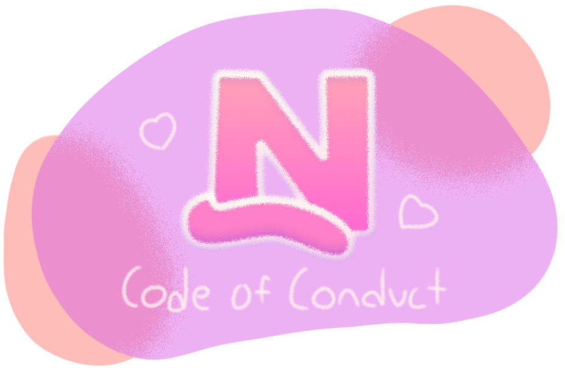

  

Nekomide is a project that is safe and welcoming for all. We respect of the contributions, dignity, and rights of all other individuals, regardless of characteristics such as age, appearance, caste, color, disabilities, ethnicity, gender identity or expression, language, level of education, national or social origin, philosophy, physical characteristics, race, religion, sex, sexual orientation, socio-economic status, or other characteristic.

## Encouraged behavior
As members of the Nekomide community, we agree to behave respecfully to other people. There are many ways to be an outstanding community member, including but not limited to:
- Committing to repairing harm when it occurs.
- Engaging nicely and honestly with others.
- Giving constructive feedback.
- Taking responsibility for actions.

## Restricted behavior
Instances, threats, and promotion of these activities and/or behaviors are violations of this Code of Conduct.
- **Attacking**: Making demeaning, insulting, or pejorative comments about a community member or group.
- **Discrimination**: Characterizing anyone's personality or behavior on the basis of immutable characteristics.
- **Endangerment**: Causing violence or harm against a person or group.
- **Failure to credit**: Intentionally failing to properly credit sources of content you contribute.
- **Harassment**: Violating the explicitly expressed boundaries of another community member.
- **Impersonation**: Leading others to believe you are a person that you are not.
- **Promotional materials**: Unsolicitedly sharing marketing or other commercial content.
- **Sexualization**: Behaving in a way generally considered inappropriately intimate in a community context.

## Reporting
When a violation of this Code of Conduct is made, it should be reported to a maintainer of Nekomide via email ([contact@raynec.dev](mailto:contact@raynec.dev)).

Community moderators take reports of violations seriously and will make every effort to respond in a timely manner. They will investigate all reports of Code of Conduct violations, reviewing messages, logs, and recordings, or interviewing witnesses and other participants. Community moderators will keep investigation and enforcement actions as transparent as possible while prioritizing safety and confidentiality. In order to honor these values, enforcement actions are carried out in private with the involved parties, but communicating to the whole community may be part of a mutually agreed upon resolution.

## Enforcement
If an investigation by the community moderators finds that this Code of Conduct has been violated, the following enforcement ladder may be used to determine how best to repair harm, based on the incident's impact on the individuals involved and the community as a whole. Depending on the severity of a violation, lower rungs on the ladder may be skipped.

### 1. Correction

**Community Impact**: Use of behavior deemed unwelcome in the community.

**Consequence**: A private, written warning from community leaders, providing clarity around the nature of the violation and an explanation of why the behavior was inappropriate. A public apology may be requested.

### 2. Warning

**Community Impact**: A violation through a single incident or series of actions.

**Consequence**: A warning with consequences for continued behavior. No interaction with the people involved, including unsolicited interaction with those enforcing the Code of Conduct, for a specified period of time. This includes avoiding interactions in community spaces as well as external channels like social media. Violating these terms may lead to a temporary or permanent ban.

### 3. Temporary Ban

**Community Impact**: A serious violation of community standards, including sustained inappropriate behavior.

**Consequence**: A temporary ban from any sort of interaction or public communication with the community for a specified period of time. No public or private interaction with the people involved, including unsolicited interaction with those enforcing the Code of Conduct, is allowed during this period. Violating these terms may lead to a permanent ban.

### 4. Permanent Ban

**Community Impact**: Demonstrating a pattern of violation of community standards, including sustained inappropriate behavior,  harassment of an individual, or aggression toward or disparagement of classes of individuals.

**Consequence**: A permanent ban from any sort of public interaction within the community.

## Attribution
This Code of Conduct is adapted from the Contributor Covenant, available at https://www.contributor-covenant.org/version/3/0/code_of_conduct.
